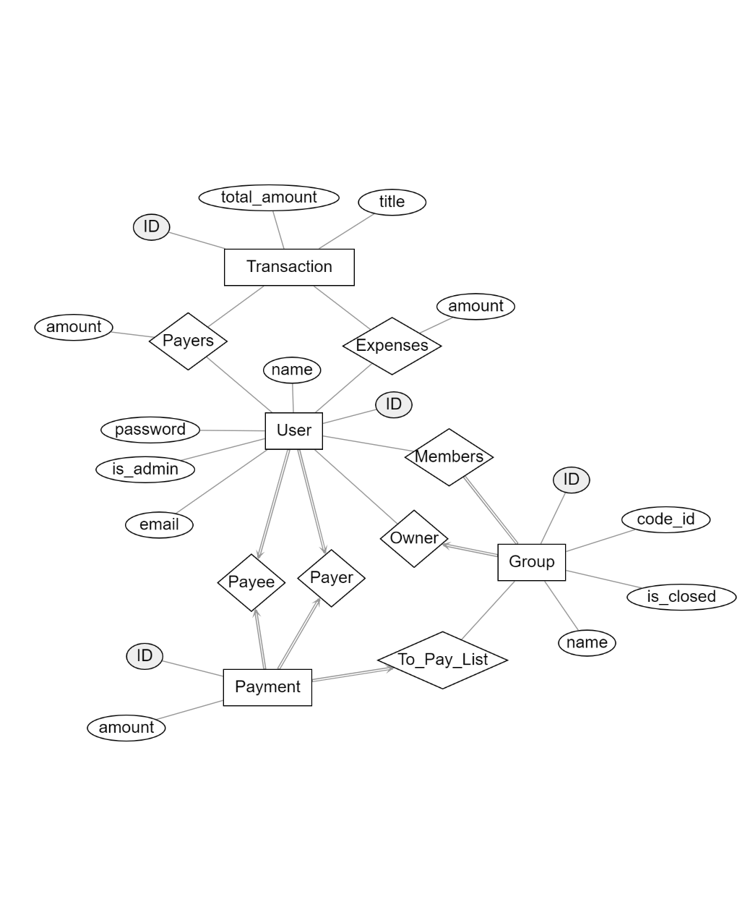

# Splitlux Backend

### To run the app
1. Install the dependencies in requirement.txt (Tip: create a virtual environment before hand)
2. Make migrations with - `python manage.py makemigrations`
3. Migrate with - `python manage.py migrate`
4. Run server with - `python manage.py runserver`

### Create a superuser
Run `python manage.py createsuperuser`

### Creating a virtual environment
Requirements: virtualenv
Installation: `pip install virtualenv`

1. Create the environment - `python -m venv env`
2. Activate the environment - `env/Scripts/activate`
3. Deactivate the environment - `env/Scripts/deactivate`

### Class diagram

### End Points
|ENDPOINT | HTTPS METHODS | DESCRIPTION | 
| ------------- |:-------------:| ------------- |
|/auth/users | POST | Create a new user |
|/auth/users | GET | Retrieves user data |
|/auth/jwt/create/ | POST | Login user |
| | | |
|/group/list/ | GET | Returns a simplified list of groups |
|/group/create/ | POST | Creates a new group |
|/group/join/ | PUT | Join a group with group_id |
|/group/<uuid:id>/ | GET | Retrieves the data of a group |
|/group/calculatepayment/<uuid:id>/ | GET | Gets the payments and closes the group (Calculating payment not done) |
|  |  |  |
|/transaction/create/ | POST | Creates a new transaction |
|/transaction/<uuid:id>/ | GET | Gets the specified transaction |
|/transaction/delete/<uuid:id>/ | DELETE | Delete the specified transaction |

